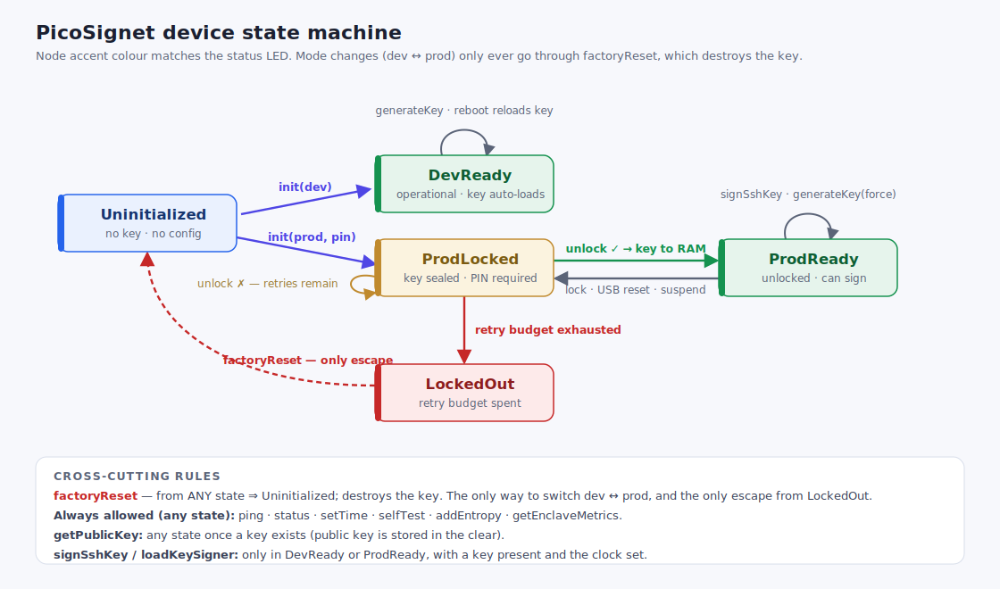

# PicoSignet wire protocol

The device speaks the cerberus `ssh-cert-signer` protocol verbatim, plus an
additive `hsm` management envelope. This document is the authoritative wire
spec.

## Framing

- One JSON object per line, terminated by `\n` (0x0A), UTF-8.
- Request = exactly one variant set (see below). The device rejects a line with
  more than one signer-path/`hsm` variant.
- The device caps a request line at **16 KiB** (the enclave caps at 256 KiB —
  see [Divergences](#divergences-from-cerberus)). Oversize lines are drained to
  the next newline and answered with a top-level error.
- The response is one JSON object + `\n`. Every signer-path failure is a
  **top-level** `{"error":"<string>"}`, exactly as cerberus does.

## Signer-path requests (cerberus-compatible)

The request envelope (mirrors `messages.Request`):

```json
{ "loadKeySigner": {...}, "signSshKey": {...}, "ping": {...}, "getEnclaveMetrics": {...} }
```

### `signSshKey`

```json
{"signSshKey":{
  "ssh_key": "ssh-ed25519 AAAA… comment",   // bare authorized_keys; no options/trailing data
  "key_id": "user@host",
  "principals": ["user","admin"],            // 1..100, none blank
  "validity": "8h",                          // Go duration string, >0, <=24h
  "permissions":      {"permit-pty":""},     // optional → cert Extensions
  "custom_attributes":{"login@x":"alice"},   // optional → merged into Extensions
  "critical_options": {"force-command":"…"}  // optional → cert CriticalOptions
}}
```

Response: `{"signSshKey":{"signed_key":"ssh-ed25519-cert-v01@openssh.com AAAA…"}}`
(single-line OpenSSH certificate, no trailing whitespace).

**Certificate population** (identical to cerberus): random 32-byte nonce, random
`uint64` serial, `CertType` = user always, `KeyId`/`ValidPrincipals` from the
request, `ValidAfter` = now − 300 s, `ValidBefore` = now + validity, `Extensions`
= `permissions ∪ custom_attributes` (key collision rejected), `CriticalOptions`
from the request. Signed with the device's Ed25519 CA key.

**Validation** runs in cerberus's order and reproduces its error strings:
field-presence → `time.ParseDuration` → principals → permissions∩custom_attrs →
key parse → algorithm/size (RSA 2048–8192, ECDSA P-256/384/521, Ed25519) →
duration sign → duration ≤ 24 h.

### `ping`

`{"ping":{}}` → `{"pong":{"signerLoaded":bool}}` where `signerLoaded` is true
only when the device is operational **and** has a loaded key **and** the clock
is set (so a host load-balancer treats an un-provisioned/locked/clock-unset
device as unhealthy).

### `loadKeySigner`

`{"loadKeySigner":{"credentials":{…}}}` → `{"loadKeySigner":{"success":true}}` if
a signer is available (dev, or prod after unlock), else top-level
`{"error":"CA signer is not initialized; call LoadKeySigner first"}`. **The AWS
credentials are ignored** — the device has no KMS dependency.

### `getEnclaveMetrics`

`{"getEnclaveMetrics":{}}` → `{"enclaveMetrics":{"cpu":{…},"memory":{…}}}` with
the same JSON shape as the enclave. CPU is device uptime in the `user` slot,
zero elsewhere; memory reports total SRAM and the firmware's free-heap estimate.

## `hsm` management envelope (additive)

A fifth request variant carries device provisioning/lifecycle. Management
**errors** stay *inside* the `hsm` response as a structured object (signer-path
errors stay top-level). The bridge firewalls these away from network clients
unless `--allow-remote-mgmt` is set.

Error object: `{"code":"ERR_*","message":"…","remainingAttempts":N,"backoffMs":N}`
(the last two only on PIN failures).

| Command          | Request                                                                            | Success response                                                                                                                 |
| ---------------- | ---------------------------------------------------------------------------------- | -------------------------------------------------------------------------------------------------------------------------------- |
| init (dev)       | `{"hsm":{"init":{"mode":"dev"}}}`                                                  | `{"hsm":{"init":{"ok":true,"mode":"dev"}}}`                                                                                      |
| init (prod)      | `{"hsm":{"init":{"mode":"prod","pin":"…","maxRetries":10,"wipeOnLockout":false}}}` | `{"hsm":{"init":{"ok":true,"mode":"prod"}}}`                                                                                     |
| generateKey      | `{"hsm":{"generateKey":{"force":false}}}`                                          | `{"hsm":{"generateKey":{"ok":true,"publicKey":"ssh-ed25519 AAAA… picosignet-ca"}}}`                                                  |
| getPublicKey     | `{"hsm":{"getPublicKey":{}}}`                                                      | `{"hsm":{"getPublicKey":{"publicKey":"…"}}}`                                                                                     |
| unlock           | `{"hsm":{"unlock":{"pin":"…"}}}`                                                   | `{"hsm":{"unlock":{"ok":true}}}`                                                                                                 |
| lock             | `{"hsm":{"lock":{}}}`                                                              | `{"hsm":{"lock":{"ok":true}}}`                                                                                                   |
| setTime          | `{"hsm":{"setTime":{"unixSeconds":N}}}`                                            | `{"hsm":{"setTime":{"ok":true,"uptimeMs":…,"previousSet":bool}}}`                                                                |
| status           | `{"hsm":{"status":{}}}`                                                            | see below                                                                                                                        |
| changePin        | `{"hsm":{"changePin":{"currentPin":"…","newPin":"…"}}}`                            | `{"hsm":{"changePin":{"ok":true}}}`                                                                                              |
| addEntropy       | `{"hsm":{"addEntropy":{"hex":"…"}}}` (≤1024 B)                                     | `{"hsm":{"addEntropy":{"ok":true}}}`                                                                                             |
| selfTest         | `{"hsm":{"selfTest":{}}}`                                                          | per-test pass/fail (below)                                                                                                       |
| factoryReset     | `{"hsm":{"factoryReset":{"confirm":"ERASE"}}}`                                     | `{"hsm":{"factoryReset":{"ok":true}}}`                                                                                           |
| rebootBootloader | `{"hsm":{"rebootBootloader":{}}}`                                                  | `{"hsm":{"rebootBootloader":{"ok":true}}}`, then the device resets into the USB bootloader (BOOTSEL) ~80 ms later for reflashing |

`status` payload: `state` (`uninitialized`/`devReady`/`prodLocked`/`prodReady`/
`lockedOut`), `mode`, `keyPresent`, `unlocked`, `clockSet`, `unixSeconds`,
`uptimeMs`, `retryRemaining` (prod), `fwVersion`, `serial` (chip id hex, from
OTP), `heapFreeBytes`, plus the security posture: `otpSecret` (per-device
wrapping secret present and loaded), `glitchArmed` (voltage-glitch detectors
armed), `secureBoot` (bootrom signed-boot enforcement burned), `glitchReset`
(the last chip reset was a glitch-detector trigger). The simulator reports
`otpSecret:true` (mock secret) and the other three false.

`selfTest` payload: `{"ok":bool,"tests":{"ed25519Kat","sha2Kat","aeadKat",
"drbgHealth","flashCrc","otpSecret"}}` each `"pass"`/`"fail"`.

### Notable behaviors

- **Time**: the device has no battery-backed RTC and the signing protocol
  carries no timestamp. Push wall-clock time with `setTime`; the device tracks
  it as `monotonic + offset`. Until time is set, `signSshKey` fails closed with
  `{"error":"device clock not set; send hsm.setTime first"}`. The bridge sends
  `setTime` on connect and every 5 minutes.
- **Entropy**: the RP2350 hardware TRNG is sampled raw (its built-in
  post-processing bypassed), health-checked on-device (repetition-count +
  adaptive-proportion per SP 800-90B), then SHA-512-conditioned into a ChaCha20
  DRBG. `addEntropy` mixes host-supplied bytes in additively — never as a sole
  source.
- **Modes are not switched in place**: dev↔prod requires `factoryReset` (which
  destroys the key) then `init`. This is the one-way production property.
- **prod init generates the key** (it has the PIN); `generateKey` in dev creates
  the key, and in prod (unlocked) rotates it with `force`.

### Error codes

`ERR_BAD_REQUEST`, `ERR_ALREADY_INIT`, `ERR_NOT_INIT`, `ERR_NO_KEY`,
`ERR_KEY_EXISTS`, `ERR_LOCKED`, `ERR_BAD_PIN`, `ERR_LOCKED_OUT`,
`ERR_CLOCK_UNSET`, `ERR_BAD_MODE`, `ERR_ENTROPY`, `ERR_FLASH`, `ERR_OVERSIZE`,
`ERR_BUSY`, `ERR_INTERNAL`.

## Status LED

The on-board WS2812 (the firmware targets the Waveshare RP2350-One: data
GPIO16, no power-enable pin) shows the device state at a glance:

| State                | Color                                                                         |
| -------------------- | ----------------------------------------------------------------------------- |
| Uninitialized        | blue                                                                          |
| DevReady / ProdReady | green                                                                         |
| ProdLocked           | amber                                                                         |
| LockedOut            | red                                                                           |
| processing a request | white (held for the duration — a slow Argon2id unlock visibly holds white for ~1 s) |

## State machine



Always allowed (any state): `ping`, `getEnclaveMetrics`, `status`, `setTime`,
`selfTest`, `addEntropy`. `getPublicKey` works whenever a key is present (the
public key is stored in the clear). `signSshKey`/`loadKeySigner` succeed only in
`DevReady`/`ProdReady` with a key and a set clock.

## Divergences from cerberus

These are the only places the device's behavior differs from the enclave; none
affect a correctly-formed signing request:

1. **Request size cap**: 16 KiB on the device vs 256 KiB on the enclave. The
   largest legitimate request (RSA-8192 key + 100 principals + maps) is ≈6 KiB.
   Oversize lines get `{"error":"request too large (max 16384 bytes)"}`.
2. **Parse-error text**: for a malformed public key, the enclave forwards
   `x/crypto/ssh`'s exact parse-error string; the device emits
   `failed to parse public key: invalid authorized key`. Both reject. RSA > 8192
   is rejected at the device's policy step (`rejected public key: RSA key too
   large…`) rather than at the parser. The differential suite asserts the
   accept/reject decision and class, not these byte strings; all
   `invalid request:` / duration / `RSA key too small` messages **are**
   byte-identical.
3. **VSOCK CID on non-Nitro hosts**: `ssh-cert-api` dials VSOCK CID 16. A plain
   Linux host cannot bind a vsock listener as CID 16 (loopback is CID 1). The
   drop-in path is the `CERBERUS_SIGNER_ENDPOINT` override (implemented on the
   cerberus `usbhsm-signer-endpoint` branch): run the bridge on TCP/Unix and set
   `CERBERUS_SIGNER_ENDPOINT=tcp://127.0.0.1:5000`. Unset, the API keeps dialing
   VSOCK CID 16 unchanged. Alternatives that need no api change: run the bridge
   in a VM whose CID is 16, or `socat` a vsock CID-16 listener to the bridge.
   See `docs/PROVISIONING.md`.
4. **USB VID/PID**: interim `1209:000A` (pid.codes community VID) with product
   string `PicoSignet`; apply for a permanent pid.codes PID before distribution.
